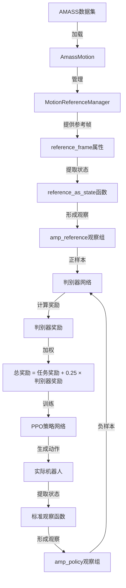
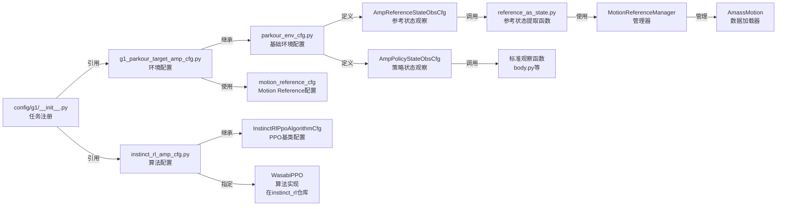
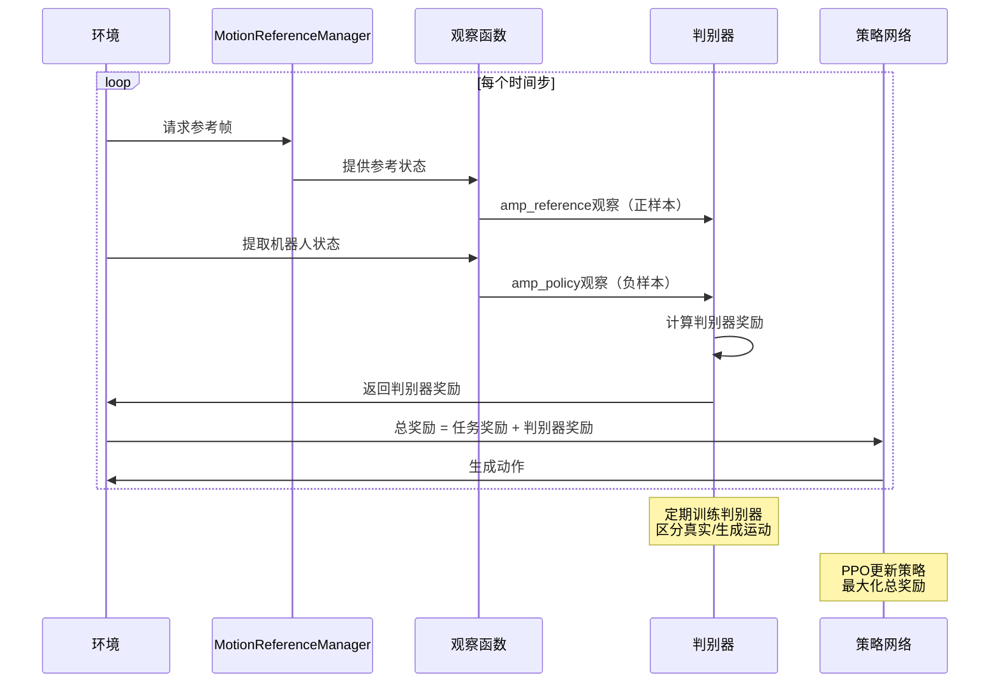

# AMP算法相关文件详细讲解

本文档详细讲解项目中每个与AMP（Adversarial Motion Prior）算法相关的文件，包括文件作用、关键代码、与AMP的关系等。

## 目录

1. [文件分类和层次结构](#文件分类和层次结构)
2. [第一层：配置入口文件](#第一层配置入口文件)
3. [第二层：Motion Reference系统](#第二层motion-reference系统)
4. [第三层：观察空间实现](#第三层观察空间实现)
5. [第四层：基础工具](#第四层基础工具)
6. [数据流和调用关系](#数据流和调用关系)

---

## 文件分类和层次结构

AMP算法的文件组织分为四个层次：

```
配置层（用户可见）
    ├── 算法配置
    ├── 环境配置
    └── 任务注册
        ↓
Motion Reference层（数据管理）
    ├── 管理器
    ├── 配置
    └── 数据加载
        ↓
观察空间层（状态提取）
    ├── 策略状态观察
    └── 参考状态观察
        ↓
基础工具层（基础设施）
    └── 算法基类
```

---

## 第一层：配置入口文件

### 1. `instinct_rl_amp_cfg.py` - 算法配置核心

**文件路径：** `source/instinctlab/instinctlab/tasks/parkour/config/g1/agents/instinct_rl_amp_cfg.py`

**主要作用：**
这是AMP算法的核心配置文件，定义了判别器网络结构、训练参数、奖励系数等所有与AMP训练相关的超参数。

**关键类和配置：**

#### `AmpAlgoCfg` - AMP算法配置类

```python
@configclass
class AmpAlgoCfg(InstinctRlPpoAlgorithmCfg):
    class_name = "WasabiPPO"  # 指定使用WasabiPPO算法（在instinct_rl仓库中实现）
    
    # 判别器网络结构
    discriminator_kwargs = {
        "hidden_sizes": [1024, 512],  # 两层MLP：1024 -> 512 -> 1
        "nonlinearity": "ReLU",
    }
    
    # 判别器奖励系数（控制风格奖励的权重）
    discriminator_reward_coef = 0.25
    
    # 判别器奖励类型：二次型（quadratic）
    discriminator_reward_type = "quad"
    
    # 判别器损失函数
    discriminator_loss_func = "MSELoss"
    
    # 梯度惩罚系数（用于稳定训练，防止模式崩塌）
    discriminator_gradient_penalty_coef = 5.0
    
    # 判别器优化器配置
    discriminator_optimizer_class_name = "AdamW"
    discriminator_weight_decay_coef = 3e-4
    discriminator_logit_weight_decay_coef = 0.04
    discriminator_optimizer_kwargs = {
        "lr": 1.0e-4,  # 判别器学习率（通常比策略网络小）
        "betas": [0.9, 0.999],
    }
    
    # PPO标准参数
    value_loss_coef = 1.0
    use_clipped_value_loss = True
    clip_param = 0.2
    entropy_coef = 0.006
    num_learning_epochs = 5
    num_mini_batches = 4
    learning_rate = 1.0e-3
    schedule = "adaptive"
    gamma = 0.99
    lam = 0.95
    desired_kl = 0.01
    max_grad_norm = 1.0
```

**关键参数说明：**

1. **`discriminator_kwargs`**: 定义判别器网络结构
   - `hidden_sizes: [1024, 512]` - 两层全连接层，输入是状态特征，输出是标量（真实/生成概率）
   - `nonlinearity: "ReLU"` - 激活函数

2. **`discriminator_reward_coef = 0.25`**: 
   - 控制判别器奖励在总奖励中的权重
   - 总奖励 = 任务奖励 + 0.25 × 判别器奖励
   - 这个值需要平衡：太小则风格不明显，太大则可能忽略任务目标

3. **`discriminator_reward_type = "quad"`**:
   - 二次型奖励：`reward = -logit^2` 或类似形式
   - 鼓励策略生成让判别器难以区分的运动

4. **`discriminator_gradient_penalty_coef = 5.0`**:
   - WGAN-GP风格的梯度惩罚，稳定判别器训练
   - 防止判别器梯度爆炸或消失

5. **`discriminator_optimizer_kwargs["lr"] = 1.0e-4`**:
   - 判别器学习率通常比策略网络小（策略网络是1e-3）
   - 确保判别器训练更稳定

#### `G1ParkourPPORunnerCfg` - 训练运行器配置

```python
@configclass
class G1ParkourPPORunnerCfg(InstinctRlOnPolicyRunnerCfg):
    num_steps_per_env = 24  # 每个环境收集24步数据
    max_iterations = 30000  # 最大训练迭代次数
    save_interval = 5000    # 每5000次迭代保存一次
    experiment_name = "g1_parkour"
    policy = MoEPolicyCfg()  # 使用MoE（Mixture of Experts）策略网络
    algorithm = AmpAlgoCfg()  # 使用AMP算法配置
```

**在AMP中的角色：**
- 这个文件是AMP算法的"大脑"，定义了所有训练超参数
- 虽然算法实现在`instinct_rl`仓库中，但所有可配置的参数都在这里定义
- 通过`class_name = "WasabiPPO"`，训练时会加载对应的算法实现

**与其他文件的关系：**
- 继承自`InstinctRlPpoAlgorithmCfg`（在`rl_cfg.py`中定义）
- 被`g1_parkour_target_amp_cfg.py`中的环境配置引用
- 通过`config/g1/__init__.py`注册到任务系统

---

### 2. `g1_parkour_target_amp_cfg.py` - 环境配置入口

**文件路径：** `source/instinctlab/instinctlab/tasks/parkour/config/g1/g1_parkour_target_amp_cfg.py`

**主要作用：**
这是AMP任务的完整环境配置入口，整合了机器人配置、地形配置、Motion Reference配置等所有环境相关设置。

**关键配置：**

#### `AmassMotionCfg` - AMASS运动数据配置

```python
@configclass
class AmassMotionCfg(AmassMotionCfgBase):
    path = os.expanduser("~/Datasets")  # AMASS数据集路径
    retargetting_func = None
    filtered_motion_selection_filepath = os.expanduser(
        "~/Datasets/parkour_motion_without_run.yaml"  # 运动选择文件
    )
    motion_start_from_middle_range = [0.0, 0.9]  # 从运动中间开始采样
    motion_start_height_offset = 0.0
    ensure_link_below_zero_ground = False
    buffer_device = "output_device"  # 使用输出设备（GPU）
    motion_interpolate_func = motion_interpolate_bilinear  # 双线性插值
    velocity_estimation_method = "frontward"  # 前向速度估计
```

**关键参数说明：**

1. **`path`**: AMASS数据集根目录
   - 需要包含重定向后的运动数据（`.npz`文件）
   - 通常以`retargeted.npz`结尾

2. **`filtered_motion_selection_filepath`**: 
   - YAML文件，指定使用哪些运动序列
   - 可以过滤掉不适合的运动（如纯跑步动作）

3. **`motion_start_from_middle_range = [0.0, 0.9]`**:
   - 允许从运动的中间部分开始采样
   - 增加数据多样性，避免总是从开始位置重置

#### `motion_reference_cfg` - Motion Reference管理器配置

```python
motion_reference_cfg = MotionReferenceManagerCfg(
    prim_path="{ENV_REGEX_NS}/Robot/torso_link",
    robot_model_path=G1_CFG.spawn.asset_path,
    reference_prim_path="/World/envs/env_.*/RobotReference/torso_link",
    
    # 对称增强配置（左右对称，增加数据多样性）
    symmetric_augmentation_link_mapping=[0, 1, 3, 2, 5, 4, 7, 6, 9, 8, 11, 10, 13, 12],
    symmetric_augmentation_joint_mapping=G1_29Dof_TorsoBase_symmetric_augmentation_joint_mapping,
    symmetric_augmentation_joint_reverse_buf=G1_29Dof_TorsoBase_symmetric_augmentation_joint_reverse_buf,
    
    # 时间配置
    frame_interval_s=0.02,  # 每帧间隔20ms（50Hz）
    update_period=0.02,    # 更新周期20ms
    num_frames=10,         # 向前看10帧（0.2秒）
    
    # 运动缓冲区
    motion_buffers={
        "run_walk": AmassMotionCfg(),  # 名为"run_walk"的运动缓冲区
    },
    
    # 关注的链接（用于计算参考状态）
    link_of_interests=[
        "pelvis", "torso_link",
        "left_shoulder_roll_link", "right_shoulder_roll_link",
        "left_elbow_link", "right_elbow_link",
        "left_wrist_yaw_link", "right_wrist_yaw_link",
        "left_hip_roll_link", "right_hip_roll_link",
        "left_knee_link", "right_knee_link",
        "left_ankle_roll_link", "right_ankle_roll_link",
    ],
    mp_split_method="Even",  # 多进程数据分割方法
)
```

**关键参数说明：**

1. **`frame_interval_s=0.02`**: 
   - 参考运动的时间分辨率（50Hz）
   - 与仿真步长匹配（通常也是0.02s）

2. **`num_frames=10`**:
   - 向前看10帧（0.2秒的未来）
   - 用于生成参考状态序列

3. **`motion_buffers`**:
   - 可以定义多个运动缓冲区
   - 每个缓冲区对应一个运动数据集
   - AMP会从这些缓冲区中采样真实运动

4. **`link_of_interests`**:
   - 指定需要跟踪的机器人链接
   - 这些链接的状态会被提取用于判别器

#### `G1ParkourEnvCfg` - 完整环境配置

```python
@configclass
class G1ParkourEnvCfg(G1ParkourRoughEnvCfg, ShoeConfigMixin):
    def __post_init__(self):
        super().__post_init__()
        self.apply_shoe_config()  # 应用鞋子配置
        # 继承自ParkourEnvCfg，包含所有MDP配置
        # 包括观察、奖励、终止条件等
```

**在AMP中的角色：**
- 这个文件是AMP环境的"总指挥"
- 整合了所有配置：机器人、地形、Motion Reference、观察空间、奖励等
- 通过继承`ParkourEnvCfg`，自动包含了AMP所需的观察配置

**与其他文件的关系：**
- 继承自`ParkourEnvCfg`（在`parkour_env_cfg.py`中定义）
- 使用`motion_reference_cfg`配置Motion Reference系统
- 通过`config/g1/__init__.py`注册为任务

---

### 3. `parkour_env_cfg.py` - 基础环境配置（包含AMP观察配置）

**文件路径：** `source/instinctlab/instinctlab/tasks/parkour/config/parkour_env_cfg.py`

**主要作用：**
定义了Parkour任务的基础环境配置，包括场景、观察空间、奖励、终止条件等。最重要的是，这里定义了AMP所需的两个观察组。

**关键配置：**

#### `AmpPolicyStateObsCfg` - 策略状态观察配置

```python
@configclass
class AmpPolicyStateObsCfg(ObsGroup):
    concatenate_terms = False  # 不拼接，保持分组结构
    
    # 投影重力（在机器人基座坐标系中）
    projected_gravity = ObsTerm(
        func=mdp.projected_gravity,
        params={"asset_cfg": SceneEntityCfg("robot")},
        history_length=10,  # 10帧历史
    )
    
    # 相对关节位置（相对于默认位置）
    joint_pos_rel = ObsTerm(
        func=mdp.joint_pos_rel,
        history_length=10,
        flatten_history_dim=True,  # 展平历史维度
        params={
            "asset_cfg": SceneEntityCfg(
                name="robot",
                preserve_order=True,
            ),
        },
    )
    
    # 相对关节速度
    joint_vel = ObsTerm(
        func=mdp.joint_vel_rel,
        scale=0.05,  # 缩放因子
        history_length=10,
        flatten_history_dim=True,
        params={
            "asset_cfg": SceneEntityCfg(
                name="robot",
                preserve_order=True,
            ),
        },
    )
    
    # 基座线速度（在基座坐标系中）
    base_lin_vel = ObsTerm(
        func=mdp.base_lin_vel,
        history_length=10,
        flatten_history_dim=True,
        params={"asset_cfg": SceneEntityCfg("robot")},
    )
    
    # 基座角速度（在基座坐标系中）
    base_ang_vel = ObsTerm(
        func=mdp.base_ang_vel,
        history_length=10,
        flatten_history_dim=True,
        params={"asset_cfg": SceneEntityCfg("robot")},
    )
```

**关键说明：**

1. **`concatenate_terms = False`**:
   - 保持观察项分组，不拼接成单个向量
   - 允许算法分别处理不同类型的观察

2. **`history_length=10`**:
   - 每个观察项包含10帧历史
   - 提供时序信息，帮助判别器理解运动模式

3. **`flatten_history_dim=True`**:
   - 将历史维度展平
   - 例如：`(num_envs, 10, 3)` -> `(num_envs, 30)`

4. **观察项选择**:
   - 选择了5个关键状态：重力方向、关节位置、关节速度、基座线速度、基座角速度
   - 这些状态足以描述机器人的运动状态

#### `AmpReferenceStateObsCfg` - 参考运动状态观察配置

```python
@configclass
class AmpReferenceStateObsCfg(ObsGroup):
    concatenate_terms = False
    
    # 参考运动的投影重力
    projected_gravity = ObsTerm(
        func=mdp.projected_gravity_reference_as_state,  # 注意：使用_reference_as_state版本
        params={"asset_cfg": SceneEntityCfg(name="motion_reference")},
        history_length=10,
    )
    
    # 参考运动的相对关节位置
    joint_pos_rel = ObsTerm(
        func=mdp.joint_pos_rel_reference_as_state,
        history_length=10,
        flatten_history_dim=True,
        params={"asset_cfg": SceneEntityCfg(name="motion_reference")},
    )
    
    # 参考运动的相对关节速度
    joint_vel = ObsTerm(
        func=mdp.joint_vel_rel_reference_as_state,
        scale=0.05,
        history_length=10,
        flatten_history_dim=True,
        params={"asset_cfg": SceneEntityCfg(name="motion_reference")},
    )
    
    # 参考运动的基座线速度
    base_lin_vel = ObsTerm(
        func=mdp.base_lin_vel_reference_as_state,
        history_length=10,
        flatten_history_dim=True,
        params={"asset_cfg": SceneEntityCfg(name="motion_reference")},
    )
    
    # 参考运动的基座角速度
    base_ang_vel = ObsTerm(
        func=mdp.base_ang_vel_reference_as_state,
        history_length=10,
        flatten_history_dim=True,
        params={"asset_cfg": SceneEntityCfg(name="motion_reference")},
    )
```

**关键说明：**

1. **函数命名模式**:
   - 所有函数都以`_reference_as_state`结尾
   - 表示从Motion Reference中提取状态，而不是从实际机器人

2. **`asset_cfg: SceneEntityCfg("motion_reference")`**:
   - 指定从`motion_reference`场景实体获取数据
   - 与策略状态观察形成对比（策略状态来自`"robot"`）

3. **观察结构完全一致**:
   - 与`AmpPolicyStateObsCfg`的结构完全相同
   - 确保策略状态和参考状态可以直接比较

#### 观察组注册

```python
@configclass
class ObservationsCfg:
    # 标准观察组（用于策略和价值函数）
    policy: PolicyCfg = PolicyCfg()
    critic: CriticCfg = CriticCfg()
    
    # AMP训练专用观察组
    amp_policy: AmpPolicyStateObsCfg = AmpPolicyStateObsCfg()
    amp_reference: AmpReferenceStateObsCfg = AmpReferenceStateObsCfg()
```

**在AMP中的角色：**
- `amp_policy`观察组：提供策略生成的状态序列（负样本）
- `amp_reference`观察组：提供参考运动的状态序列（正样本）
- 判别器接收这两组观察，学习区分真实运动和生成运动

**与其他文件的关系：**
- 观察函数实现在`observations/reference_as_state.py`中
- 被`g1_parkour_target_amp_cfg.py`中的环境配置继承
- 通过`mdp.__init__.py`导入所有MDP函数

---

### 4. `config/g1/__init__.py` - 任务注册

**文件路径：** `source/instinctlab/instinctlab/tasks/parkour/config/g1/__init__.py`

**主要作用：**
将AMP任务注册到Gymnasium任务系统，使其可以通过任务ID调用。

**关键代码：**

```python
import gymnasium as gym
from . import agents

task_entry = "instinctlab.tasks.parkour.config.g1"

# 注册训练任务
gym.register(
    id="Instinct-Parkour-Target-Amp-G1-v0",
    entry_point="instinctlab.envs:InstinctRlEnv",
    disable_env_checker=True,
    kwargs={
        "env_cfg_entry_point": f"{task_entry}.g1_parkour_target_amp_cfg:G1ParkourEnvCfg",
        "instinct_rl_cfg_entry_point": f"{agents.__name__}.instinct_rl_amp_cfg:G1ParkourPPORunnerCfg",
    },
)

# 注册测试/可视化任务
gym.register(
    id="Instinct-Parkour-Target-Amp-G1-Play-v0",
    entry_point="instinctlab.envs:InstinctRlEnv",
    disable_env_checker=True,
    kwargs={
        "env_cfg_entry_point": f"{task_entry}.g1_parkour_target_amp_cfg:G1ParkourEnvCfg_PLAY",
        "instinct_rl_cfg_entry_point": f"{agents.__name__}.instinct_rl_amp_cfg:G1ParkourPPORunnerCfg",
    },
)
```

**关键说明：**

1. **任务ID**:
   - `Instinct-Parkour-Target-Amp-G1-v0`: 训练任务
   - `Instinct-Parkour-Target-Amp-G1-Play-v0`: 测试/可视化任务

2. **配置入口点**:
   - `env_cfg_entry_point`: 指向环境配置类
   - `instinct_rl_cfg_entry_point`: 指向算法配置类

3. **使用方式**:
   ```bash
   # 训练
   python scripts/instinct_rl/train.py --task=Instinct-Parkour-Target-Amp-G1-v0
   
   # 测试
   python scripts/instinct_rl/play.py --task=Instinct-Parkour-Target-Amp-G1-Play-v0
   ```

**在AMP中的角色：**
- 这是AMP任务的"入口点"
- 通过任务ID，系统可以自动加载对应的配置
- 连接环境配置和算法配置

---

## 第二层：Motion Reference系统

### 5. `motion_reference/__init__.py` - 模块说明

**文件路径：** `source/instinctlab/instinctlab/motion_reference/__init__.py`

**主要作用：**
模块的入口文件，导出核心类和配置，并提供AMP使用说明。

**关键代码：**

```python
"""The implementation for reading and returning motion reference data.

FAQ:
    - How to use this module in AMP/WASABI implementation?
        * Use the motion reference to build discriminator observation and feed to the algorithm
        * Use the discriminator observation and discriminator (in algo) to label the discrimintaor
        reward.
"""

from .motion_reference_cfg import MotionReferenceManagerCfg, NoCollisionPropertiesCfg
from .motion_reference_data import MotionReferenceData, MotionReferenceState, MotionSequence
from .motion_reference_manager import MotionReferenceManager
```

**关键说明：**

1. **FAQ部分**:
   - 明确说明了在AMP中的使用方法
   - 使用Motion Reference构建判别器观察
   - 使用判别器观察和判别器计算奖励

2. **导出内容**:
   - `MotionReferenceManagerCfg`: 配置类
   - `MotionReferenceManager`: 核心管理器类
   - `MotionReferenceData`: 数据结构类

**在AMP中的角色：**
- 提供模块级别的文档和说明
- 导出所有AMP需要的类和配置

---

### 6. `motion_reference_manager.py` - 核心管理器

**文件路径：** `source/instinctlab/instinctlab/motion_reference/motion_reference_manager.py`

**主要作用：**
Motion Reference系统的核心管理器，负责管理多个运动缓冲区、更新参考帧数据、提供参考状态给判别器等。

**关键类和属性：**

#### `MotionReferenceManager` 类

```python
class MotionReferenceManager(SensorBase):
    """管理所有运动参考数据的管理器"""
    
    def __init__(self, cfg: MotionReferenceManagerCfg):
        super().__init__(cfg)
        # 初始化运动缓冲区
        # 初始化参考帧数据
        # 初始化时间戳等
```

#### `reference_frame` 属性 - 当前参考帧

```python
@property
def reference_frame(self) -> MotionReferenceData:
    """当前时间步的参考状态（被动获取）"""
    outdated_mask = torch.logical_or(
        (self._reference_frame_timestamp - self._timestamp).abs() > 1e-6,
        self._reference_frame_timestamp < 1e-6
    )
    if outdated_mask.any():
        # 更新过时的参考帧
        env_ids_to_update = self._ALL_INDICES[outdated_mask]
        for name, buffer in self._motion_buffers.items():
            buffer.fill_motion_data(
                env_ids_this_buffer,
                self._timestamp[env_ids_this_buffer].unsqueeze(-1),
                self.env_origins,
                self._reference_frame,
            )
        self._reference_frame_timestamp[outdated_mask] = self._timestamp[outdated_mask]
    return self._reference_frame
```

**关键说明：**

1. **懒更新机制**:
   - 只有当时间戳过期时才更新
   - 避免不必要的计算

2. **多缓冲区支持**:
   - 可以管理多个运动缓冲区
   - 每个环境可以分配到不同的缓冲区

3. **参考帧内容**:
   - `base_pos_w`: 基座位置（世界坐标系）
   - `base_quat_w`: 基座姿态（世界坐标系）
   - `joint_pos`: 关节位置
   - `joint_vel`: 关节速度
   - `link_pos_w`: 链接位置
   - 等等...

#### `data` 属性 - 完整参考数据

```python
@property
def data(self) -> MotionReferenceData:
    """完整的参考数据（包含多帧）"""
    self._update_outdated_buffers()
    return self._data
```

**与`reference_frame`的区别：**
- `reference_frame`: 单帧数据（当前时间步）
- `data`: 多帧数据（向前看`num_frames`帧）

**在AMP中的角色：**
- 提供参考运动的状态数据
- 这些数据被`reference_as_state.py`中的函数提取
- 形成`amp_reference`观察组，作为判别器的正样本

**数据流：**
```
AMASS数据文件
    ↓
AmassMotion (加载)
    ↓
MotionReferenceManager (管理)
    ↓
reference_frame (当前帧)
    ↓
reference_as_state函数 (提取状态)
    ↓
amp_reference观察组
    ↓
判别器 (训练)
```

---

### 7. `motion_reference_cfg.py` - 配置类

**文件路径：** `source/instinctlab/instinctlab/motion_reference/motion_reference_cfg.py`

**主要作用：**
定义Motion Reference管理器的所有配置选项。

**关键配置类：**

#### `MotionReferenceManagerCfg`

```python
@configclass
class MotionReferenceManagerCfg(SensorBaseCfg):
    class_type: type = MotionReferenceManager
    
    # 机器人模型路径（用于构建运动学链）
    robot_model_path: str | None = None
    
    # 关注的链接（用于计算链接状态）
    link_of_interests: Sequence[str] | None = None
    
    # 帧数配置
    num_frames: int = 1  # 向前看的帧数
    frame_interval_s: float | Sequence[float] = 0.1  # 帧间隔
    update_period: float | Sequence[float] = 0.0  # 更新周期
    
    # 数据起始点
    data_start_from: Literal["one_frame_interval", "current_time"] = "one_frame_interval"
    
    # 运动缓冲区配置
    motion_buffers: dict[str, MotionBufferCfg] = {}
    
    # 多进程分割方法
    mp_split_method: Literal["None", "Even", "Segment"] = "None"
    
    # 对称增强配置
    symmetric_augmentation_joint_mapping: Sequence[int] | None = None
    symmetric_augmentation_joint_reverse_buf: Sequence | None = None
```

**关键参数说明：**

1. **`num_frames`**:
   - 向前看的帧数
   - 在AMP中通常设为10，提供0.2秒的未来信息

2. **`frame_interval_s`**:
   - 帧之间的时间间隔
   - 通常与仿真步长匹配（0.02s）

3. **`data_start_from`**:
   - `"one_frame_interval"`: 第0帧在`t+frame_interval_s`
   - `"current_time"`: 第0帧在`t`
   - AMP通常使用`"one_frame_interval"`

4. **`motion_buffers`**:
   - 字典，键是缓冲区名称，值是配置
   - 可以定义多个缓冲区（如不同风格的运动）

5. **`mp_split_method`**:
   - 多进程数据分割方法
   - `"Even"`: 均匀分配
   - `"Segment"`: 分段分配

**在AMP中的角色：**
- 定义Motion Reference系统的所有参数
- 在`g1_parkour_target_amp_cfg.py`中实例化
- 控制参考数据的生成方式

---

### 8. `motion_files/amass_motion.py` - 数据加载

**文件路径：** `source/instinctlab/instinctlab/motion_reference/motion_files/amass_motion.py`

**主要作用：**
从AMASS数据集加载运动数据，处理重定向、插值、速度估计等。

**关键类：**

#### `AmassMotion` 类

```python
class AmassMotion(MotionBuffer):
    """从AMASS数据集加载运动数据"""
    
    def _load_motion_sequences(self):
        """加载运动序列"""
        # 1. 扫描数据集目录
        # 2. 读取.npz文件
        # 3. 应用重定向函数
        # 4. 应用插值函数
        # 5. 估计速度
        # 6. 分割成运动段（bins）
        pass
    
    def fill_motion_data(self, env_ids, timestamps, env_origins, motion_data):
        """填充运动数据到指定环境"""
        # 1. 根据时间戳查找对应的运动帧
        # 2. 应用环境原点偏移
        # 3. 填充到motion_data中
        pass
```

**关键功能：**

1. **数据加载**:
   - 从`.npz`文件加载运动数据
   - 支持过滤（通过YAML文件）

2. **重定向**:
   - 将人体运动重定向到机器人
   - 通过`retargetting_func`配置

3. **插值**:
   - 使用双线性插值平滑运动
   - 通过`motion_interpolate_func`配置

4. **速度估计**:
   - 从位置数据估计速度
   - 方法：`"frontward"`（前向差分）或`"backward"`（后向差分）

5. **运动分割**:
   - 将长运动序列分割成固定长度的段（bins）
   - 用于自适应采样

**在AMP中的角色：**
- 从AMASS数据集加载真实运动数据
- 这些数据是判别器的正样本来源
- 通过Motion Reference Manager提供给环境

**数据格式：**
AMASS数据文件（`.npz`）应包含：
- `joint_pos`: 关节位置 `(T, num_joints)`
- `base_pos`: 基座位置 `(T, 3)`
- `base_quat`: 基座姿态 `(T, 4)`
- `link_pos`: 链接位置 `(T, num_links, 3)`
- `link_quat`: 链接姿态 `(T, num_links, 4)`
- 等等...

---

### 9. `motion_files/amass_motion_cfg.py` - 数据配置

**文件路径：** `source/instinctlab/instinctlab/motion_reference/motion_files/amass_motion_cfg.py`

**主要作用：**
定义AMASS运动数据的配置选项。

**关键配置类：**

```python
@configclass
class AmassMotionCfg(MotionBufferCfg):
    path: str = MISSING  # 数据集路径
    retargetting_func: Callable | None = None  # 重定向函数
    filtered_motion_selection_filepath: str | None = None  # 过滤文件
    motion_start_from_middle_range: Sequence[float] = [0.0, 1.0]  # 起始范围
    motion_start_height_offset: float = 0.0  # 高度偏移
    ensure_link_below_zero_ground: bool = False
    buffer_device: str = "output_device"  # 设备
    motion_interpolate_func: Callable = motion_interpolate_bilinear  # 插值函数
    velocity_estimation_method: Literal["frontward", "backward"] = "frontward"
```

**在AMP中的角色：**
- 在`g1_parkour_target_amp_cfg.py`中实例化
- 配置AMASS数据的加载和处理方式

---

## 第三层：观察空间实现

### 10. `observations/reference_as_state.py` - AMP参考状态提取

**文件路径：** `source/instinctlab/instinctlab/envs/mdp/observations/reference_as_state.py`

**主要作用：**
提供从Motion Reference中提取状态观察的函数，这些函数是AMP判别器观察的核心。

**关键函数：**

#### `projected_gravity_reference_as_state` - 参考运动的投影重力

```python
class projected_gravity_reference_as_state(ManagerTermBase):
    def __init__(self, cfg: ObservationTermCfg, env: ManagerBasedEnv):
        super().__init__(cfg, env)
        self.motion_ref: MotionReferenceManager = env.scene["motion_reference"]
        
        # 获取全局重力向量
        physics_sim_view = physx.create_simulation_view("torch")
        physics_sim_view.set_subspace_roots("/")
        gravity = physics_sim_view.get_gravity()
        gravity_dir = torch.tensor((gravity[0], gravity[1], gravity[2]), device=self.device)
        gravity_dir = math_utils.normalize(gravity_dir.unsqueeze(0)).squeeze(0)
        self.GRAVITY_VEC_W = gravity_dir.repeat(len(self.motion_ref.ALL_INDICES), 1)
    
    def __call__(self, env: ManagerBasedEnv, asset_cfg: SceneEntityCfg = ...):
        """返回参考运动的投影重力（在基座坐标系中）"""
        motion_reference: MotionReferenceManager = env.scene[asset_cfg.name]
        root_quat_w = motion_reference.reference_frame.base_quat_w[:, 0]
        # 将世界坐标系的重力向量转换到基座坐标系
        projected_gravity_w = math_utils.quat_rotate_inverse(root_quat_w, self.GRAVITY_VEC_W)
        return projected_gravity_w  # (num_envs, 3)
```

**关键说明：**
- 获取参考运动的基座姿态
- 将重力向量从世界坐标系转换到基座坐标系
- 返回形状：`(num_envs, 3)`

#### `joint_pos_rel_reference_as_state` - 参考运动的相对关节位置

```python
def joint_pos_rel_reference_as_state(
    env: ManagerBasedEnv,
    asset_cfg: SceneEntityCfg = SceneEntityCfg("motion_reference"),
    robot_cfg: SceneEntityCfg = SceneEntityCfg("robot"),
):
    """参考运动的相对关节位置（相对于默认位置）"""
    motion_reference: MotionReferenceManager = env.scene[asset_cfg.name]
    joint_pos = motion_reference.reference_frame.joint_pos[:, 0, asset_cfg.joint_ids]
    robot: Articulation = env.scene[robot_cfg.name]
    # 计算相对于默认位置的偏移
    joint_pos_rel = joint_pos - robot.data.default_joint_pos[:, asset_cfg.joint_ids]
    # 应用掩码（过滤无效关节）
    return joint_pos_rel * motion_reference.reference_frame.joint_pos_mask[:, 0, asset_cfg.joint_ids]
```

**关键说明：**
- 从参考帧获取关节位置
- 减去默认位置，得到相对位置
- 应用掩码过滤无效关节

#### `joint_vel_rel_reference_as_state` - 参考运动的相对关节速度

```python
def joint_vel_rel_reference_as_state(
    env: ManagerBasedEnv,
    asset_cfg: SceneEntityCfg = SceneEntityCfg("motion_reference"),
    robot_cfg: SceneEntityCfg = SceneEntityCfg("robot"),
    mask: bool = True,
):
    """参考运动的相对关节速度"""
    motion_reference: MotionReferenceManager = env.scene[asset_cfg.name]
    joint_vel = motion_reference.reference_frame.joint_vel[:, 0, asset_cfg.joint_ids]
    if mask:
        joint_vel *= motion_reference.reference_frame.joint_vel_mask[:, 0, asset_cfg.joint_ids]
    robot: Articulation = env.scene[robot_cfg.name]
    joint_vel_rel = joint_vel - robot.data.default_joint_vel[:, asset_cfg.joint_ids]
    return joint_vel_rel
```

#### `base_lin_vel_reference_as_state` - 参考运动的基座线速度

```python
def base_lin_vel_reference_as_state(
    env: ManagerBasedEnv,
    asset_cfg: SceneEntityCfg = SceneEntityCfg("motion_reference"),
):
    """参考运动的基座线速度（在基座坐标系中）"""
    motion_reference: MotionReferenceManager = env.scene[asset_cfg.name]
    base_quat_w = motion_reference.reference_frame.base_quat_w[:, 0]
    base_lin_vel_w = motion_reference.reference_frame.base_lin_vel_w[:, 0]
    # 从世界坐标系转换到基座坐标系
    base_lin_vel_b = math_utils.quat_rotate_inverse(base_quat_w, base_lin_vel_w)
    return base_lin_vel_b
```

#### `base_ang_vel_reference_as_state` - 参考运动的基座角速度

```python
def base_ang_vel_reference_as_state(
    env: ManagerBasedEnv,
    asset_cfg: SceneEntityCfg = SceneEntityCfg("motion_reference"),
):
    """参考运动的基座角速度（在基座坐标系中）"""
    motion_reference: MotionReferenceManager = env.scene[asset_cfg.name]
    base_quat_w = motion_reference.reference_frame.base_quat_w[:, 0]
    base_ang_vel_w = motion_reference.reference_frame.base_ang_vel_w[:, 0]
    # 从世界坐标系转换到基座坐标系
    base_ang_vel_b = math_utils.quat_rotate_inverse(base_quat_w, base_ang_vel_w)
    return base_ang_vel_b
```

**函数命名模式：**
所有函数都遵循`{state_name}_reference_as_state`的命名模式，表示从Motion Reference中提取状态。

**在AMP中的角色：**
- 这些函数是AMP观察空间的核心
- 从Motion Reference提取参考状态
- 形成`amp_reference`观察组
- 与`amp_policy`观察组（从实际机器人提取）形成对比

**数据流：**
```
MotionReferenceManager.reference_frame
    ↓
reference_as_state函数
    ↓
提取状态（投影重力、关节位置、关节速度、基座速度等）
    ↓
AmpReferenceStateObsCfg
    ↓
amp_reference观察组
    ↓
判别器输入（正样本）
```

---

### 11. `observations/motion_reference.py` - 其他Motion Reference观察

**文件路径：** `source/instinctlab/instinctlab/envs/mdp/observations/motion_reference.py`

**主要作用：**
提供其他Motion Reference相关的观察函数，主要用于非AMP的任务（如Shadowing任务）。

**与AMP的关系：**
- 这些函数主要用于Shadowing任务（逐帧模仿）
- AMP主要使用`reference_as_state.py`中的函数
- 但某些函数可能被其他观察配置使用

---

## 第四层：基础工具

### 12. `utils/wrappers/instinct_rl/rl_cfg.py` - 算法基类配置

**文件路径：** `source/instinctlab/instinctlab/utils/wrappers/instinct_rl/rl_cfg.py`

**主要作用：**
定义RL算法的基类配置，包括PPO算法配置基类。

**关键配置类：**

#### `InstinctRlPpoAlgorithmCfg` - PPO算法配置基类

```python
@configclass
class InstinctRlPpoAlgorithmCfg:
    """PPO算法配置基类"""
    
    class_name: str = "PPO"  # 算法类名
    
    # 价值函数损失
    value_loss_coef: float = MISSING
    use_clipped_value_loss: bool = MISSING
    
    # 策略裁剪
    clip_param: float = MISSING
    
    # 熵正则化
    entropy_coef: float = MISSING
    
    # 训练参数
    num_learning_epochs: int = MISSING
    num_mini_batches: int = MISSING
    learning_rate: float = MISSING
    schedule: str = MISSING
    
    # GAE参数
    gamma: float = MISSING
    lam: float = MISSING
    
    # KL散度
    desired_kl: float = MISSING
    
    # 梯度裁剪
    max_grad_norm: float = MISSING
```

**在AMP中的角色：**
- `AmpAlgoCfg`继承自这个基类
- 提供PPO的标准参数
- AMP在此基础上添加了判别器相关参数

**继承关系：**
```
InstinctRlPpoAlgorithmCfg (基类)
    ↓
AmpAlgoCfg (AMP配置，添加判别器参数)
    ↓
WasabiPPO (算法实现，在instinct_rl仓库中)
```

---

## 数据流和调用关系

### AMP训练数据流



### 文件调用关系



### AMP训练流程



---

## 总结

### 文件层次总结

1. **配置层**（用户主要修改）:
   - `instinct_rl_amp_cfg.py`: 算法超参数
   - `g1_parkour_target_amp_cfg.py`: 环境配置
   - `parkour_env_cfg.py`: 观察空间配置

2. **数据管理层**:
   - `motion_reference_manager.py`: 核心管理器
   - `amass_motion.py`: 数据加载

3. **观察提取层**:
   - `reference_as_state.py`: 参考状态提取

4. **基础设施层**:
   - `rl_cfg.py`: 算法基类

### 关键设计模式

1. **配置类模式**: 所有配置都使用`@configclass`装饰器
2. **懒更新模式**: Motion Reference使用时间戳检查，避免不必要更新
3. **观察分组**: AMP使用两个观察组（policy和reference），结构完全一致
4. **函数命名**: `_reference_as_state`后缀明确标识参考状态函数

### 扩展建议

1. **添加新的参考状态**: 在`reference_as_state.py`中添加新函数
2. **修改判别器结构**: 在`instinct_rl_amp_cfg.py`中修改`discriminator_kwargs`
3. **使用不同数据集**: 在`g1_parkour_target_amp_cfg.py`中修改`AmassMotionCfg.path`
4. **调整奖励权重**: 在`instinct_rl_amp_cfg.py`中修改`discriminator_reward_coef`

---

**文档版本**: 1.0  
**最后更新**: 2026-01-26
